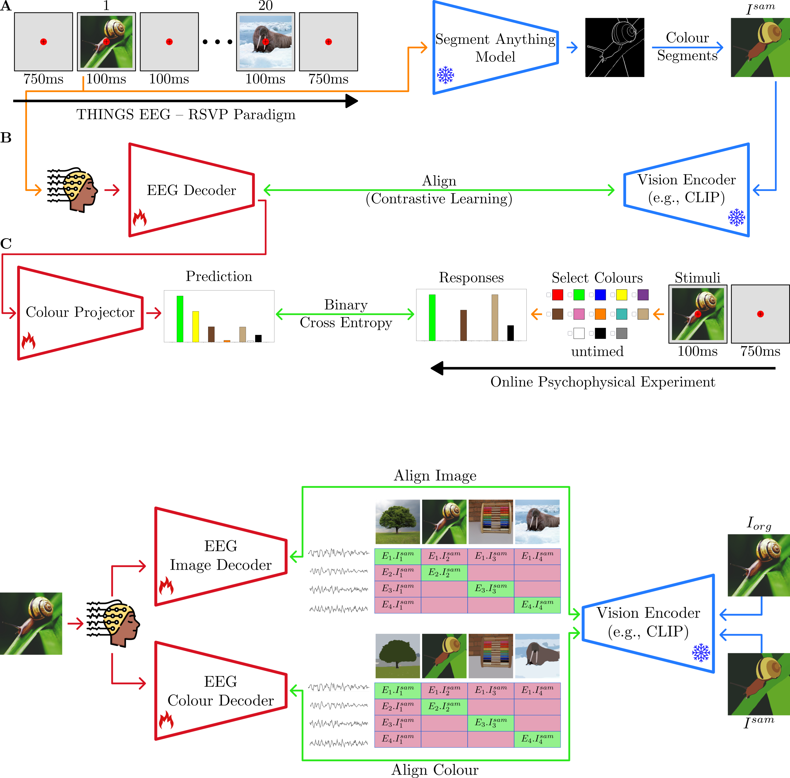

# CUBE
Joint **C**olo**U**r and o**B**j**E**ct decoding in EEG and MEG.

This repository contains the code for the article: [The footprint of colour in EEG signal](https://www.biorxiv.org/content/10.1101/2025.10.06.680651).

<p align="center">

</p>

## Data Preparation

### THINGS Dataset

Download the preprocessed EEG data from this [link](https://www.allpsych.uni-giessen.de/arash/data/THINGS_EEG2_Preprocessed_data_250Hz_whiten.zip). Please note that the file size is 23.9 GB.

Alternatively, you can download the THINGS Images [EEG](https://osf.io/anp5v/files/osfstorage) and [MEG](https://openneuro.org/datasets/ds004212/versions/2.0.1) datasets from their respective websites and preprocess them yourself using the code provided in the `preprocess` directory.


### Colour Annotations


The colour ground-truth data collected through the online psychophysical experiment are available in the GitHub repository under the `data/colour_annotations/` directory.

### Image Features

Download the CLIP features used for our best-performing model [i-org__RN50__openai__i-sam__coca_ViT-L-14__mscoco_finetuned_laion2b_s13b_b90k](https://www.allpsych.uni-giessen.de/arash/data/THINGS_EEG2_image_features.zip).

If you wish to generate the SAM-based images yourself and extract features using other CLIP models, run `sam_colour_segs.py` and `extract_features` from the `preprocess` directory.

## Training

To train CUBE, run the following command:

```console
for sub in {01..10}; do
  python cube.py \
    --config configs/eeg.yaml \
    --subjects sub-${sub} \
    --seed 0 \
    --exp_setting intra-subject \
    --brain_backbone EEGProjectLayerColour \
    --epoch 50 \
    --lr 1e-4 \
    --colour_gt_path data/colour_annotations/train.npy \
    --db_dir data/image_features/i-org__RN50__openai__i-sam__coca_ViT-L-14__mscoco_finetuned_laion2b_s13b_b90k/ \
    --name cube \
    --save_dir exp_colour
done


```

## Acknowledgement
We acknowledge the contributions of the following datasets:
 - [A large and rich EEG dataset for modeling human visual object recognition](https://www.sciencedirect.com/science/article/pii/S1053811922008758) [THINGS-EEG]
 - [
THINGS-data, a multimodal collection of large-scale datasets for investigating object representations in human brain and behavior](https://pubmed.ncbi.nlm.nih.gov/36847339/) [THINGS-MEG]

The code is inspired by prior awesome works on neural decoding tasks:
 - [Decoding Natural Images from EEG for Object Recognition](https://github.com/eeyhsong/NICE-EEG) [ICLR 2024]
 - [Visual Decoding and Reconstruction via EEG Embeddings with Guided Diffusion](https://github.com/dongyangli-del/EEG_Image_decode) [NeurIPS 2024]
 - [Bridging the Vision-Brain Gap with an Uncertainty-Aware Blur Prior ](https://github.com/HaitaoWuTJU/Uncertainty-aware-Blur-Prior)  [CVPR 2025]


## Citation
If you find this work helpful, please cite:
```bibtex
@article{akbarinia2025decoding,
  title={Decoding colour information from eeg signals in natural scenes},
  author={Akbarinia, Arash},
  journal={Cognitive Computational Neuroscience},
  year={2025}
}
```


```bibtex
@article{akbarinia2025footprint,
  title={The footprint of colour in EEG signal},
  author={Akbarinia, Arash},
  journal={bioRxiv},
  pages={2025--10},
  year={2025}
}
```


